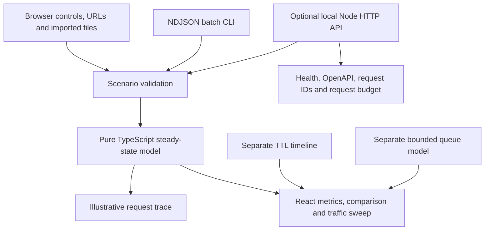

# Signal Lab: making system trade-offs inspectable

> Historical engineering reference: this describes the original systems dashboard, retired from the public page on October 10. Its models, local API, and CLI remain available in source. The current portfolio presents four independent games and interactive pieces.

**[Try the browser lab](https://jhonsmithromerosolorzano.github.io/portfolio-lab/#lab)** · [Run the local API](server/README.md) · [Read the model](src/domain/simulation/simulation.ts)

Signal Lab is an original portfolio project by Jhon Smith Romero. It turns a familiar engineering conversation—traffic, caching, database capacity, and failure—into a small experiment a reviewer can reproduce. It is not a production benchmark or a claim about a previous employer's systems.

## A five-minute walkthrough

1. Start with 120 requests per second, an 80% read-cache hit rate, and eight normal database connections. All requests succeed in this model.
2. Turn the cache off. Database demand rises above its 100 req/s capacity. Set traffic to exactly 100, then 101, to inspect the boundary.
3. Capture that setup as a baseline. Re-enable caching and compare latency, success percentage points, and database demand.
4. Set the database offline. Cached reads still succeed; uncached reads and writes time out. Add a write share to see why a read cache cannot preserve write availability.
5. Open the separate expiry and queue experiments. A longer TTL can return stale data; a larger buffer can postpone rejection while work waits.

Use a share link, a named local experiment, or a JSON snapshot to revisit a setup. A traffic sweep holds all other inputs fixed, and the batch CLI evaluates multiple scenarios without a browser.

## What actually runs



The public site is static HTML, CSS, and JavaScript. Its architecture diagram describes a modeled browser/API/cache/database path. It does not establish network connections to Redis or a database. The optional local API is a real HTTP server that calculates the same model; it is not the database shown in the diagram.

Keeping the calculation in a pure function makes the UI, API, and CLI agree. URL parsing falls back safely per field. File imports recalculate results rather than trusting numbers embedded in a snapshot. The API and CLI reject unknown scenario properties to catch misspellings.

## The steady-state model

For offered load `R`, write fraction `w`, and read-cache hit fraction `h`:

```text
reads             = R × (1 − w)
writes            = R × w
cache hits        = cache enabled ? reads × h : 0
database demand   = R − cache hits
database capacity = online ? connections × 1000 / database latency : 0
database served   = min(demand, capacity)
failed            = R − cache hits − database served
```

Each request adds 12 ms of API overhead. Cache hits take another 8 ms. Database operations take 80 ms normally or 400 ms in slow mode. Requests beyond capacity, or requiring an offline database, receive a modeled 1,000 ms timeout. Reads and writes have equal database cost here; that is an explicit simplification.

The default 120 req/s scenario sends 96 reads to cache and 24 to the database. Its mean response is `12 + (96×8 + 24×80)/120 = 34.4 ms`. This mean includes both successes and timeouts. It is not p95 or p99, and it can conceal a poor experience for a minority of requests. Fractional per-second counts represent steady-state rates, not fractional individual requests.

With the cache disabled, eight 80 ms connections have capacity `8×1000/80 = 100 req/s`. Request conservation is an invariant: **cached + database-served + failed = offered**. Tests check this across supported scenarios.

## Separate time-based experiments

The TTL timeline reads one key each second from t=0 through t=20. The origin changes just before t=5. A cache miss stores the latest version for the selected TTL; hits do not renew expiry. With an eight-second TTL, t=5, 6, and 7 return stale version 1. At t=8, an expired entry is fetched again. The strategy selector also offers invalidation on the origin update and stale-while-revalidate. Invalidation expires the cached entry before the t=5 read. Stale-while-revalidate returns expired data while a single background fetch completes before the next second; it captures the origin version when it starts. Origin-read totals include background fetches. These policies assume successful fetches, no variable network delay, and no link to the main model's hit-rate slider.

The queue experiment has eight one-second ticks with arrivals `[4, 4, 20, 20, 4, 4, 4, 4]`. Each tick serves old backlog first and then arrivals. Excess work waits up to the buffer limit; overflow rejects the newest arrivals. At capacity 8 and buffer 16, 56 requests finish, 8 are rejected, and none remain waiting. With no buffer, 24 are rejected. The conservation rule is **completed + rejected + waiting = total arrivals**. Waiting work never counts as successful. There are no retries, deadlines, or within-tick latency estimates.

The queue now offers equal-volume steady and single-spike profiles alongside the original burst. An optional recovery phase adds no new arrivals and serves only accepted backlog. Rejected requests never reappear.

The request scheduler uses discrete arrival and completion events, fixed service time, configurable worker concurrency, and a bounded FIFO waiting queue. Completions and already-queued work take priority over arrivals at the same timestamp. Optional deadlines include wait plus service; queued requests expire before dispatch and running requests are cancelled at their deadline, releasing a worker. Completion exactly at the deadline succeeds. This is deliberately different from the main model’s steady-state rates: individual requests have integer identities and explicit timestamps, and the experiment drains through terminal outcomes.

The retry experiment starts eight requests together and models an instant failure before a chosen recovery time, then instant success. Exponential backoff and optional seeded full jitter schedule future attempts; a global budget limits retry amplification independently of the per-request limit. The trace shows where a budget or attempt limit ends work. Jitter can consume retries before recovery, so it does not guarantee success. This experiment excludes server capacity, network latency, and deadlines; it does not silently combine those assumptions with the scheduler.

## The local service boundary

The Node service uses the standard HTTP module because this example has a small route surface and no routing dependency is needed. Its purpose is to make the boundary inspectable: JSON parsing, shared input validation, a 16 KiB body limit, request IDs, structured completion logs, and predictable error responses. An OpenAPI document describes the contract.

Simulation POSTs share an in-memory fixed-window budget. Rejection returns 429 and a retry delay. This illustrates backpressure; it is not a distributed rate limiter. Health and contract reads remain available. The launcher binds to loopback and shuts down on SIGINT/SIGTERM. Public service hosting, authentication, TLS termination, and distributed state remain outside this milestone.

Logs contain a generated request ID, normalized route, method, status, timestamp, and duration. They exclude payloads, query strings, cookies, and client addresses. Correlation is useful without collecting those values.

## Evidence and limits

`npm test` covers the model, request conservation, URL round trips, storage/file boundaries, comparison, expiry, queues, rate-window boundaries, batch CLI exit codes, and real HTTP responses on an ephemeral loopback port. `npm run build` checks TypeScript for the browser, server, and scripts before producing static assets. GitHub Actions runs both before Pages deployment.

Browser checks cover precise traffic input, baseline comparison, saved-library persistence, file import, expiry/queue interaction, and a narrow mobile viewport. A permanent Playwright suite now runs recruiter navigation, résumé downloads, theme persistence, mobile layout, legacy links, and imported URL state in Chromium and WebKit before Pages deployment. Browser downloads depend on host support; copyable JSON/CSV views provide a visible fallback. File contents are generated and tested independently.

The browser suite now also covers comparison restoration, saved-library edits, cross-tab changes, deadline outcomes, cache accounting, and keyboard table scrolling. Unit tests check exact event ordering, conservation, retry budgets, reproducibility, and invalid imports. The local development client now checks explicitly requested scenarios through the Node service. A same-origin development proxy avoids enabling CORS. Replies are bounded and checked against the echoed scenario, model version, and all calculated fields. Cancellation and input changes invalidate pending replies. HTTP round-trip time remains separate from modeled latency; published builds never contact localhost.

## Compact investigations across the stack

The portfolio puts professional experience before the lab. The lab presents one experiment at a time in a bounded workspace, with an optional expanded view, instead of growing the page as tools are opened. Its searchable catalog separates frontend, backend, data, and workspace tools. The catalog, sharing controls, and guides are secondary options behind **More experiments**, keeping the initial portfolio view focused on one working demo. Guided investigations ask a question, load a reproducible configuration, and reveal evidence on demand.

Six additional pure models expose specific decisions:

| Experiment          | Decision                                                         | Limits                                                                      |
| ------------------- | ---------------------------------------------------------------- | --------------------------------------------------------------------------- |
| Async search        | Render every response or only the latest request                 | Three fixed input times; ignoring a result does not cancel backend work     |
| Debounce / throttle | Emit every event, after a quiet period, or on a leading interval | Fixed finite streams; leading throttle has no trailing flush                |
| Circuit breaker     | Open after failures and probe after a cooldown                   | Sequential instantaneous calls, with no rolling window or concurrent probes |
| Rate limiting       | Reset fixed windows or refill a bounded token bucket             | Fixed arrivals; admission only, without service time or retries             |
| Cache eviction      | Evict oldest insertion or least recent use                       | Equal-size items, successful origin reads, no expiration or value changes   |
| Concurrent writes   | Overwrite, reject stale versions, or reread and retry a delta    | Atomic version comparison and known rejection; no lost acknowledgments      |

These are independent illustrations, not measurements or claims about a combined service. Each keeps its assumptions visible. The scheduler chart separates queue wait from worker time, including expiration before dispatch. The retry chart compares seeded jitter with synchronized attempts on the same axes and includes exact per-window counts.

Versioned configuration links validate all fields before applying them and always recompute results. Event playback is manual to start, stops when its context changes, and gives way to manual stepping under reduced motion. The timeline, selectors, event log, and raw tables preserve access without depending on color or animation.

## Review path

- [`src/domain/simulation/simulation.ts`](src/domain/simulation/simulation.ts): formulas and core assumptions.
- [`src/domain/simulation/scenario-validation.ts`](src/domain/simulation/scenario-validation.ts): shared input contract.
- [`src/domain/simulation/cache-expiry.ts`](src/domain/simulation/cache-expiry.ts) and [`src/domain/simulation/queue-model.ts`](src/domain/simulation/queue-model.ts): time-based experiments.
- [`server/api.ts`](server/api.ts) and [`server/openapi.json`](server/openapi.json): HTTP boundary and contract.
- [`scripts/replay.ts`](scripts/replay.ts): batch execution.
- [`tests/`](tests/): behavior and boundary checks.

Features were developed with AI assistance and checked through tests, builds, and browser inspection. All code and examples in this project are original portfolio work; no employer code, client data, or private interview material is included.
